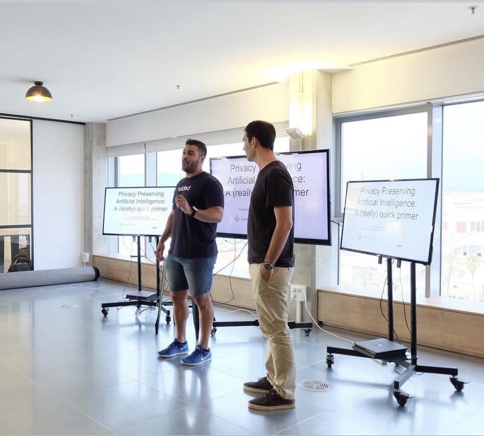
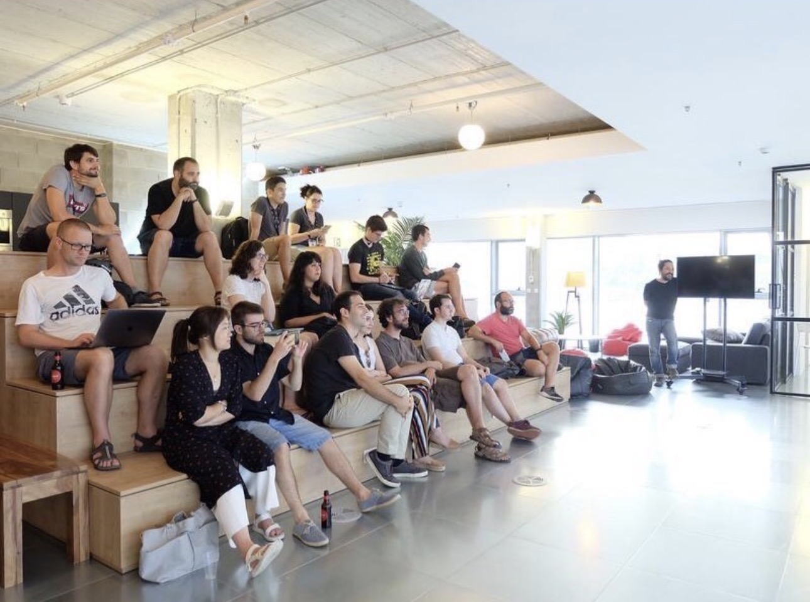

<div align="center">


<a href="https://www.linkedin.com/in/elvingomezmejia/">
  
</a>
<a href="https://github.com/3lv27">
  
</a>
<a href="https://www.youtube.com/channel/UC1YEuQpT5QHRxHY8_ArquiQ?sub_confirmation=1">
  
</a>

<br/><br/>


<br/><br/>


</div>

---

## 🧑‍💻 Code Mode

```ts
const elvin = {
  roles: ["Founder @ RAISE Lab", "AI Architect", "Educator", "Community Builder"],
  basedIn: "Spain",

  since: {
    ai: 2018,
    teaching: 2019,
    data: "7+ years"
  },

  focusNow: [
    "Agent systems",
    "Voice + chat experiences",
    "LLMOps (tracing, prompts, evals)",
    "AI-assisted development workflows"
  ],

  stack: {
    languages: ["Python", "TypeScript", "Node.js", "Scala", "Go"],
    ai: ["PyTorch", "Hugging Face", "LangGraph", "Langfuse", "Unsloth"],
    dataLakehouse: ["PostgreSQL", "Kafka", "Spark", "Flink", "Iceberg", "Parquet", "Snowflake", "Airflow"],
    cloudDevOps: ["GCP", "AWS", "Azure", "Docker", "Terraform", "GitHub Actions"]
  },

  beliefs: [
    "No hype — ship real systems",
    "Great AI needs great communities",
    "You learn fastest by building together"
  ]
};
```

---

📺 Learn with Me (YouTube)

<div align="center">


<a href="https://www.youtube.com/channel/UC1YEuQpT5QHRxHY8_ArquiQ?sub_confirmation=1">
  
</a>


<br/>


⭐ Featured: Fine-tuning LLMs with Unsloth

</div>


---

🌍 Community in Action

<div align="center">






</div>


<p align="center">
Workshops, meetups, and community sessions on AI & engineering.
</p>


---

🧠 What I Build

<table>
<tr>
<td width="50%" valign="top">


🚀 Product-First AI Systems
	•	Agent workflows (LangGraph)
	•	Voice + chat systems
	•	LLMOps & evaluation
	•	Production reliability

</td>
<td width="50%" valign="top">


🏗️ Data & Lakehouse Platforms
	•	Iceberg / Parquet lakehouses
	•	Spark (batch) + Flink (streaming)
	•	Kafka pipelines
	•	Airflow + Snowflake

</td>
</tr>
</table>


---

🗺️ Timeline

2018  → Autonomous drones (Saturdays.ai · Award)
2019  → Teaching Deep Learning
2020–2022 → Data platforms
2023–Now → GenAI & Agents
Today → Founder · Educator · Community Builder


---

🚀 Featured Work

<div align="center">


<a href="https://github.com/codingmindset/CodingMindset-YouTube">
  
</a>


<a href="https://github.com/3lv27">
  
</a>


</div>


---


<div align="center">


Open to collaborating on AI systems, community initiatives, and education.

</div>
